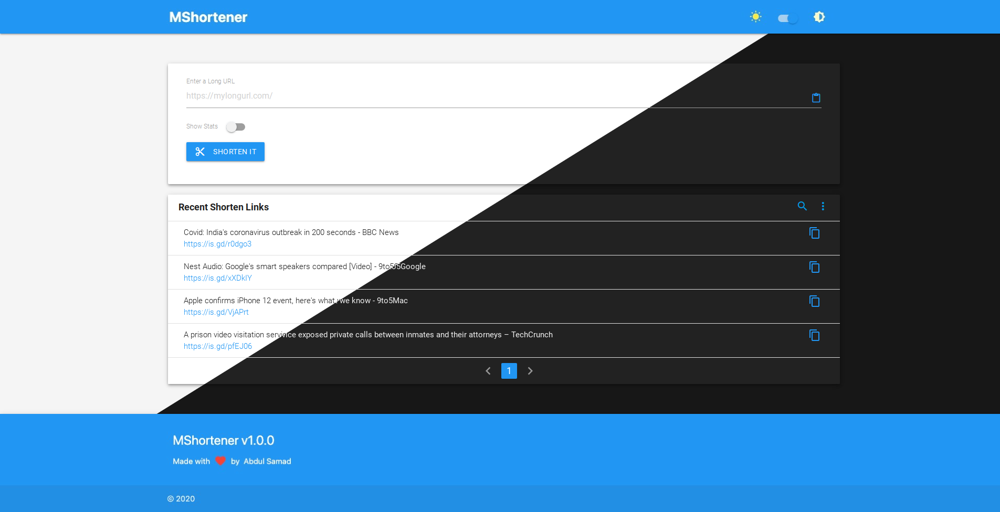

## MShortener

A simple and minimal link shortener with backup and restore

### :sparkles: Features

- Generate a shorten link of an URL
- Light/Dark Theme
- Import/Export all previous shorten URL's
- Offline Support (Not for generating new shorten links)
- uses IndexDB for storing data (with fallback to WebSQL & LocalStorage)

> **Note:** Short URL's cannot be deleted after generation and will continue to redirect to their intended destination even after you've deleted it locally.

